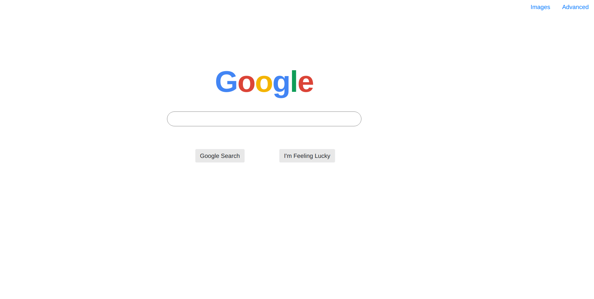
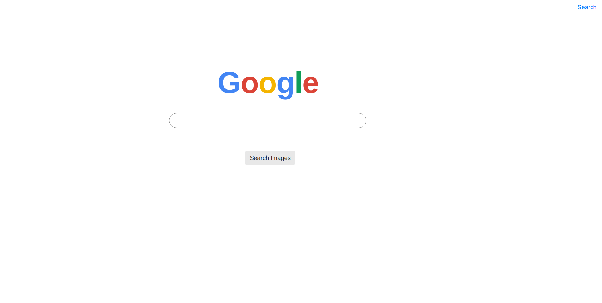
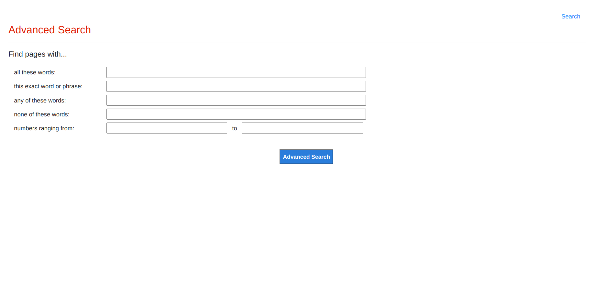

# Search

Google Frontend - Users are redirected to google's search results page after entering their search query.

**Search Page**


**Image Search Page**


**Advanced Search Page**


**Steps to render HTML pages locally**
1) Clone the repository.
2) From the directory, run `<web_browser> <name_of_html_file>`, for example:

```
google-chrome index.html
```
